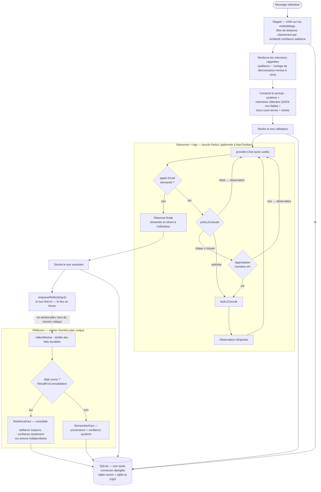
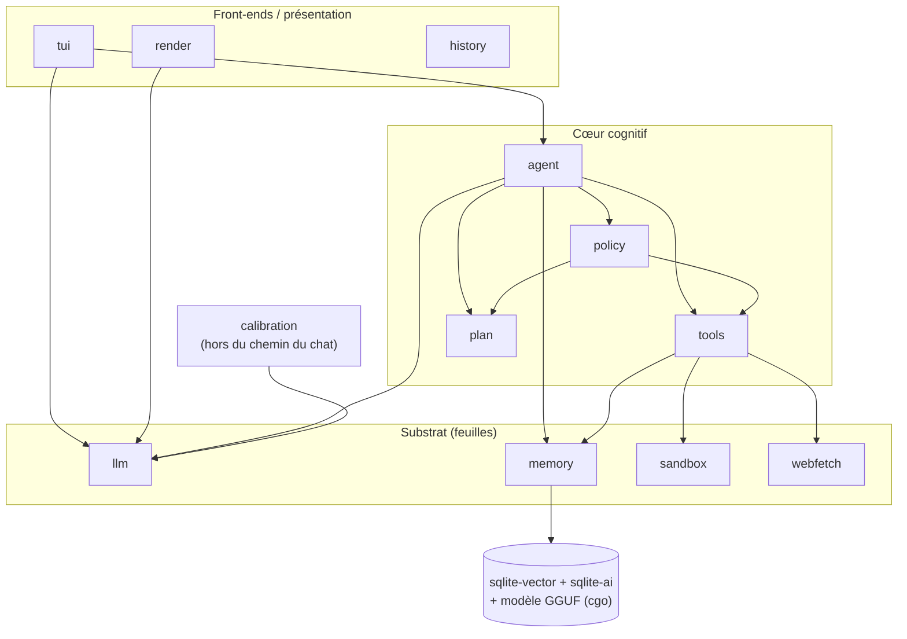

# Architecture de Talunor — le modèle mental

**Langue :** [🇬🇧 English](architecture.md) · 🇫🇷 Français

Cette page est la **carte que l'on lit avant le terrain** : un tour de la boucle
cognitive, comment les packages s'articulent, et la poignée de décisions qui
donnent sa forme au système. Elle est volontairement courte.

- Pour un index **fichier par fichier**, voir [`docs/atlas.md`](atlas.md).
- Pour le **pourquoi, enseigné pas à pas**, voir le [cours](lessons/README.fr.md) (26 leçons).
- Pour les **conventions de contribution** (rituel de release, pièges), voir
  [`AGENTS.md`](../AGENTS.md).

Talunor est un agent IA de terminal doté d'une boucle cognitive complète
(percevoir → rappeler → raisonner → agir → apprendre) sur une mémoire multi-niveaux.
La seule idée à garder en tête tout au long de ce qui suit : **un agent fiable n'est
pas un LLM plus intelligent ; c'est un système où les actions, la mémoire, la
confiance et l'apprentissage franchissent chacun une frontière explicite et
vérifiable.**

---

## 1. Un tour de la boucle

Un unique `Agent.Turn` exécute la boucle de façon synchrone et streame la réponse à
l'utilisateur ; **l'apprentissage est délégué à l'arrière-plan et le tour se
termine**. Les appels d'outils passent par une barrière de politique (policy) — et,
quand ils sont risqués, par un o/n humain — avant de s'exécuter.

En mots :

1. **Percevoir & rappeler.** Le message de l'utilisateur est vectorisé (embedding)
   et comparé à la mémoire long terme (KNN en force brute), filtré par distance
   cosinus, puis classé par `similarité · confiance · saillance-effective`. Les
   mémoires rappelées sont *renforcées* (avoir servi est un signal qu'elles comptent).
2. **Raisonner.** Le prompt est assemblé : le prompt système, les mémoires rappelées
   **clôturées comme DATA non fiable** (une mitigation contre l'injection de prompt),
   les tours court-terme récents, et la nouvelle entrée.
3. **Agir.** Le modèle peut demander des outils. Chaque appel est enveloppé en un
   plan à une étape et soumis à `policy.Evaluate` : un **refus** devient une
   observation (fail-closed), un appel **risqué** met en pause pour une approbation
   humaine, un appel **autorisé** s'exécute. L'observation est réinjectée et le
   modèle est rappelé, jusqu'à `MaxToolIters`.
4. **Stocker.** Le tour utilisateur est enregistré immédiatement ; le tour assistant
   une fois la réponse streamée.
5. **Apprendre — plus tard.** Le tour n'attend **pas** l'apprentissage. Il met en
   file le message et rend la main ; un worker d'arrière-plan unique distille des
   faits durables et soit en stocke un nouveau, soit *consolide* une reformulation
   sur la ligne existante.

> **Variante planner** (`TALUNOR_PLANNER=1`) : avant d'agir, l'agent produit un plan
> explicite et inspectable, l'humain approuve le plan entier, puis cette même boucle
> ReAct s'exécute **plafonnée aux outils du plan** — le modèle ne peut pas appeler un
> outil que le plan approuvé n'a pas nommé.

---

## 2. Comment les packages s'articulent

Les packages internes forment un **DAG — aucun cycle d'import**. Le cœur cognitif
(`agent`) dépend du substrat ; le substrat ne dépend jamais en retour. Les coutures
entre couches sont des **interfaces**, ce qui rend chaque couche testable
isolément avec un fake.

Les flèches se lisent **« importe / dépend de ».** À remarquer :

- **`plan` est tout en bas.** C'est un vocabulaire pur (`Plan`, `PlanStep`,
  `RiskLevel`) partagé par `policy` et `agent`, volontairement sans dépendance pour
  qu'il n'y ait pas de cycle `policy ↔ agent`.
- **Les coutures sont des interfaces**, chacune avec un fake dans les tests :
  `llm.Provider`, `policy.Policy`, `tools.Tool`, `sandbox.Sandbox`, `agent.Planner`,
  `agent.FactExtractor`.
- **`tools` est le seul à toucher `sandbox` et `webfetch`.** L'agent n'atteint jamais
  le réseau ou le shell directement — il passe par un outil, qui passe par une
  frontière gardée.
- **`calibration` est hors du chemin critique du chat.** Il mesure la fiabilité d'un
  modèle ; il ne tourne pas pendant un tour. Le lien de retour est un seul nombre
  (`ModelConfidence`), pas une dépendance de code.
- **Le cgo vit dans `memory`.** Les deux extensions SQLite et le modèle d'embedding
  GGUF sont chargés là ; cet état C est par connexion (voir §3.1).

---

## 3. Les décisions porteuses

Six choix expliquent l'essentiel du code. Chacun renvoie à la leçon qui l'enseigne.

### 3.1 Une seule connexion SQLite épinglée *est* le modèle de concurrence
Les extensions `sqlite-ai` / `sqlite-vector` gardent le modèle chargé, le contexte
d'embedding et l'index vectoriel dans un état C **par connexion** ; `memory.Store`
épingle donc le pool à une seule connexion (`SetMaxOpenConns(1)`). Ce n'est pas une
limite contournée — c'est *exploité* : `database/sql` sérialise chaque accès, donc la
décroissance paresseuse reste une pure lecture et le worker de réflexion asynchrone
n'a besoin d'**aucun verrou supplémentaire**.
→ Leçons [02](lessons/02-persistent-memory/README.fr.md) et [19](lessons/19-off-the-critical-path/README.fr.md).

### 3.2 La confiance vient de la source, jamais de l'auto-évaluation du modèle
La `confidence` d'une mémoire est assignée par le **système** à partir de sa
provenance (`user_stated` > `model_inferred`, un `tool_observed` vérifié au-dessus des
deux), puis pondérée par la calibration mesurée du modèle — on ne demande jamais au
modèle à quel point il est sûr (un piège à sycophantie). Le renforcement n'élève la
confiance **que sur preuve indépendante** (un utilisateur qui répète compte ; le
modèle qui se fait écho à lui-même, non).
→ Leçons [16](lessons/16-measure-the-model/README.fr.md) et [17](lessons/17-learning-with-humility/README.fr.md).

### 3.3 La rétention se calcule à la lecture, pas par des écritures
La saillance décroît **paresseusement** : `Recall` calcule la saillance effective
`= saillance · 2^(−âge/demi-vie)` au moment de la requête et « oublie en douceur »
sous un plancher (la ligne survit). Aucun job de fond, aucune écriture sur le chemin
de lecture — ce dont a précisément besoin la conception à une connexion (§3.1).
→ Leçon [18](lessons/18-the-memory-of-the-gesture/README.fr.md).

### 3.4 Chaque action franchit une barrière explicite, fail-closed
Avant qu'un outil ne s'exécute, `policy.Evaluate` décide autoriser / demander /
refuser. Une erreur de policy ou un refus **échoue fermé** (le modèle observe un
refus, il n'agit pas). L'approbation d'un plan entier lie les *noms* d'outils, mais
une étape à haut risque re-confirme quand même ses **arguments réels** — approuver un
plan n'est pas un chèque en blanc.
→ Leçons [12](lessons/12-the-open-bar/README.fr.md) et [14](lessons/14-the-approval-that-didnt-bind/README.fr.md).

### 3.5 Le danger est opt-in et borné, pas « de confiance »
Les outils puissants sont **éteints par défaut** (`TALUNOR_BASH`, `TALUNOR_WEBFETCH`)
et, une fois activés, sont derrière de vraies frontières : `bash` tourne dans une
sandbox sans réseau (une frontière noyau), `web_fetch` derrière une garde SSRF dans le
hook `Control` du dialer (l'IP résolue est vérifiée juste avant le connect, re-vérifiée
à chaque redirection). Les mémoires rappelées sont clôturées comme DATA non fiable dans
le prompt. Le projet est honnête sur ce qui est une *frontière* versus de la
*défense en profondeur*.
→ Leçons [09](lessons/09-secure-web-fetching/README.fr.md) et [10](lessons/10-understand-the-sandbox/README.fr.md).

### 3.6 L'apprentissage tourne hors du chemin critique
La réflexion est un second appel LLM ; la rendre synchrone tiendrait la réponse
ouverte. À la place, le tour confie le message à une file bornée et se termine ; un
worker d'arrière-plan unique apprend derrière lui. Un seul worker + la connexion
unique épinglée signifient que les écritures du worker sont sérialisées contre les
lectures d'un tour, gratuitement.
→ Leçon [19](lessons/19-off-the-critical-path/README.fr.md).

---

*Ensuite : choisis un fil dans le [cours](lessons/README.fr.md), ou lis d'abord le
substrat dans [`internal/memory/store.go`](../internal/memory/store.go) et la boucle
dans [`internal/agent/turn.go`](../internal/agent/turn.go).*
