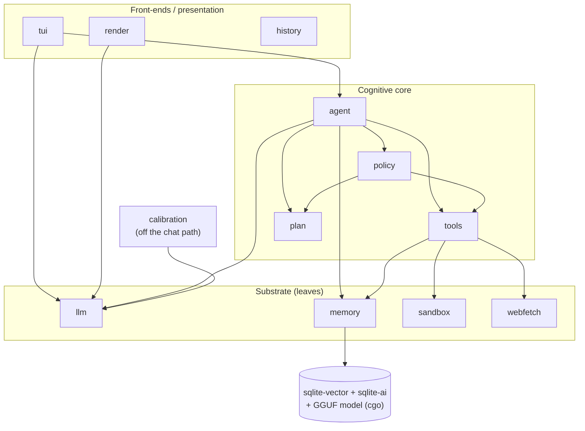

# Talunor architecture — the mental model

**Language:** 🇬🇧 English · [🇫🇷 Français](architecture.fr.md)

This page is the **map you read before the territory**: one turn of the cognitive
loop, how the packages fit together, and the handful of decisions that give the
system its shape. It is deliberately short.

- For a **file-by-file** index, see [`docs/atlas.md`](atlas.md).
- For the **why, taught step by step**, see the [course](lessons/) (26 lessons).
- For **contributor conventions** (release ritual, gotchas), see [`AGENTS.md`](../AGENTS.md).

Talunor is a terminal AI agent with a full cognitive loop
(perceive → recall → reason → act → learn) over a multi-tier memory. The one idea
worth carrying through everything below: **a reliable agent is not a smarter LLM;
it is a system where actions, memory, trust, and learning each cross an explicit,
verifiable boundary.**

---

## 1. One turn of the loop

A single `Agent.Turn` runs the loop synchronously and streams the reply to the
user; **learning is handed off to the background and the turn ends**. Tool calls
pass through a policy gate (and, when risky, a human y/n) before they run.

Reading it in words:

1. **Perceive & recall.** The user's message is embedded and matched against
   long-term memory (brute-force KNN), gated by cosine distance, then ranked by
   `similarity · confidence · effective-salience`. Recalled memories are
   *reinforced* (being useful is a signal they matter).
2. **Reason.** The prompt is assembled: the system prompt, the recalled memories
   **fenced as untrusted DATA** (a prompt-injection mitigation), the recent
   short-term turns, and the new input.
3. **Act.** The model may ask for tools. Each call is wrapped as a one-step plan
   and sent to `policy.Evaluate`: a **deny** becomes an observation (fail closed),
   a **risky** call pauses for human approval, an **allowed** call runs. The
   observation is fed back and the model is called again, up to `MaxToolIters`.
4. **Store.** The user turn is recorded immediately; the assistant turn once the
   reply has streamed.
5. **Learn — later.** The turn does **not** wait for learning. It enqueues the
   user message and returns; a single background worker distils durable facts and
   either stores a new one or *consolidates* a restatement onto the existing row.

> **Planner variant** (`TALUNOR_PLANNER=1`): before acting, the agent produces an
> explicit, inspectable plan, the human approves the whole plan, and then this same
> ReAct loop runs **capped to the plan's tools** — the model cannot call a tool the
> approved plan didn't name.

---

## 2. How the packages fit together

The internal packages form a **DAG — no import cycles**. The cognitive core
(`agent`) depends on the substrate; the substrate never depends back. The seams
between layers are **interfaces**, which is what makes each layer testable in
isolation with a fake.

Arrows read **"imports / depends on."** Things worth noticing:

- **`plan` sits at the bottom.** It is a pure vocabulary (`Plan`, `PlanStep`,
  `RiskLevel`) shared by `policy` and `agent`, deliberately dependency-free so
  there is no `policy ↔ agent` cycle.
- **The seams are interfaces**, each with a fake in tests: `llm.Provider`,
  `policy.Policy`, `tools.Tool`, `sandbox.Sandbox`, `agent.Planner`,
  `agent.FactExtractor`.
- **`tools` is the only thing that touches `sandbox` and `webfetch`.** The agent
  never reaches the network or the shell directly — it goes through a tool, which
  goes through a guarded boundary.
- **`calibration` is off the chat critical path.** It measures a model's
  reliability; it does not run during a turn. The link back is one number
  (`ModelConfidence`), not a code dependency.
- **`memory` is where cgo lives.** The two SQLite extensions and the GGUF
  embedding model are loaded here; that C state is per-connection (see §3.1).

---

## 3. The load-bearing decisions

Six choices explain most of the code. Each links to the lesson that teaches it.

### 3.1 One pinned SQLite connection *is* the concurrency model
The `sqlite-ai` / `sqlite-vector` extensions keep the loaded model, embedding
context, and vector index in **per-connection** C state, so `memory.Store` pins
the pool to a single connection (`SetMaxOpenConns(1)`). This is not a limitation
worked around — it is *used*: `database/sql` serialises every access, so lazy
decay stays a pure read and the async reflection worker needs **no extra lock**.
→ Lessons [02](lessons/02-persistent-memory/) and [19](lessons/19-off-the-critical-path/).

### 3.2 Trust comes from the source, never the model's self-report
A memory's `confidence` is assigned by the **system** from its provenance
(`user_stated` > `model_inferred`, a verified `tool_observed` above both), then
scaled by the model's measured calibration — the model is never asked how sure it
is (a sycophancy trap). Reinforcement raises confidence **only on independent
evidence** (a user restating counts; the model echoing itself does not).
→ Lessons [16](lessons/16-measure-the-model/) and [17](lessons/17-learning-with-humility/).

### 3.3 Retention is computed at read time, not maintained by writes
Salience decays **lazily**: `Recall` computes effective salience
`= salience · 2^(−age/half-life)` at the moment of the query and soft-forgets
below a floor (the row survives). No background job, no write on the read path —
which is exactly what the single-connection design (§3.1) needs.
→ Lesson [18](lessons/18-the-memory-of-the-gesture/).

### 3.4 Every action crosses an explicit, fail-closed gate
Before any tool runs, `policy.Evaluate` decides allow / prompt / deny. A policy
error or a denial **fails closed** (the model observes a refusal, it does not act).
A whole-plan approval binds the tool *names*, but a high-risk step still
re-confirms its **live arguments** — approving a plan is not a blank cheque.
→ Lessons [12](lessons/12-the-open-bar/) and [14](lessons/14-the-approval-that-didnt-bind/).

### 3.5 Danger is opt-in and bounded, not trusted
The powerful tools are **off by default** (`TALUNOR_BASH`, `TALUNOR_WEBFETCH`) and,
when on, sit behind real boundaries: `bash` runs in a network-less sandbox (a
kernel boundary), `web_fetch` runs behind an SSRF guard in the dialer's `Control`
hook (the resolved IP is vetted immediately before connect, re-checked on every
redirect). Recalled memory is fenced as untrusted DATA in the prompt. The project
is honest about what is a *boundary* versus *defense-in-depth*.
→ Lessons [09](lessons/09-secure-web-fetching/) and [10](lessons/10-understand-the-sandbox/).

### 3.6 Learning runs off the critical path
Reflection is a second LLM call; making it synchronous would hold the reply open.
Instead the turn hands the message to a bounded queue and ends; one background
worker learns behind it. One worker + the single pinned connection means the
worker's writes are serialised against a turn's reads for free.
→ Lesson [19](lessons/19-off-the-critical-path/).

---

*Next: pick a thread from the [course](lessons/), or read the substrate first in
[`internal/memory/store.go`](../internal/memory/store.go) and the loop in
[`internal/agent/turn.go`](../internal/agent/turn.go).*
