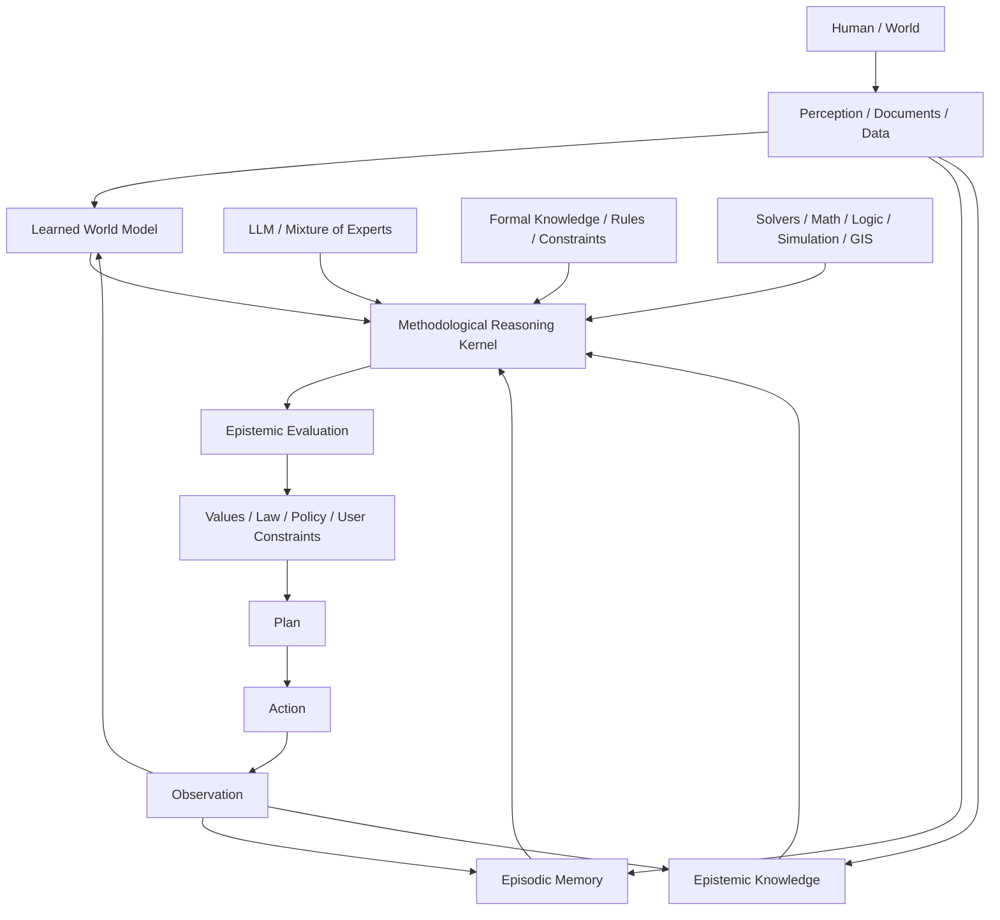

# Vision — vers une architecture cognitive épistémiquement traçable

> English version: [epistemic-reasoning-vision.md](epistemic-reasoning-vision.md)

> Document de travail — août 2026  
> Statut : **vision de recherche**, non décision d’implémentation.

## 1. Point de départ

Talunor part déjà d’un principe fort : **un agent fiable n’est pas simplement un LLM plus intelligent ; c’est un système où les actions, la mémoire, la confiance et l’apprentissage franchissent des frontières explicites et vérifiables.**

La réflexion développée ici prolonge cette idée.

Les LLM actuels sont remarquablement puissants pour le langage, l’abstraction, la synthèse, l’analogie et le code. Mais ils ne constituent probablement pas, à eux seuls, l’architecture finale d’une intelligence générale fiable.

Notre position de travail est que le futur appartient vraisemblablement à des **architectures cognitives hybrides** combinant plusieurs facultés spécialisées :

- modèles de langage / Mixture of Experts ;
- modèles du monde (*world models*) ;
- connaissances formelles et solveurs ;
- mémoire épisodique et sémantique ;
- mémoire épistémique traçable ;
- outils spécialisés ;
- planification et action ;
- protocole explicite de raisonnement méthodologique.

Le LLM reste une pièce centrale, mais il ne doit plus être confondu avec le système entier.

---

## 2. L’intuition centrale : distinguer savoir, croyance, inférence et ignorance

Un système intelligent fiable doit pouvoir distinguer explicitement :

- ce qu’il **observe** ;
- ce qu’il **sait** ;
- ce qu’il **suppose** ;
- ce qu’il **déduit** ;
- ce qui est **contesté** ;
- ce qui a été **réfuté** ;
- ce qu’il **ignore** encore.

Une information ne devrait pas être représentée seulement comme une valeur :

```text
Earth.shape = oblate_spheroid
```

mais comme une **assertion accompagnée de sa généalogie** :

```text
Claim
 ├─ value
 ├─ evidence[]
 ├─ counterEvidence[]
 ├─ sources[]
 ├─ provenance
 ├─ timestamp
 ├─ confidence
 ├─ assumptions[]
 ├─ inference trace
 ├─ status
 └─ supersession / contradiction links
```

Autrement dit :

```text
Knowledge = Claim
          + Evidence
          + Provenance
          + Confidence
          + Time
          + Contradictions
```

Cette propriété devient critique dans un monde où la quantité de contenu synthétique, biaisé ou volontairement manipulatoire peut croître beaucoup plus vite que la production de connaissances fiables.

La fréquence d’une affirmation ne doit jamais être confondue avec sa solidité :

```text
frequency != evidence
```

---

## 3. Pourquoi une architecture hybride

### 3.1 LLM / Mixture of Experts

Les modèles de langage sont particulièrement adaptés à :

- compréhension du langage ;
- abstraction ;
- synthèse ;
- analogie ;
- génération de code ;
- formulation d’hypothèses ;
- interaction naturelle avec les humains.

Ils doivent rester une composante majeure de l’architecture.

### 3.2 World models

Les travaux de Yann LeCun autour de JEPA mettent en évidence une limite importante du paradigme purement autoregressif : prédire le prochain token n’est pas équivalent à posséder un modèle interne du monde permettant de prédire les conséquences d’actions.

Un *world model* vise plutôt :

```text
observe -> represent -> predict -> plan -> act -> compare -> learn
```

Notre position n’est donc pas **LLM ou world model**, mais plutôt :

```text
LLM + world model
```

comme facultés complémentaires.

### 3.3 Connaissances formelles et solveurs

Certaines connaissances ne devraient pas dépendre d’un consensus statistique du Web.

Pour les mathématiques, la logique, la géométrie ou certaines contraintes physiques, le système devrait pouvoir déléguer à des moteurs déterministes ou formels :

- Lean / Coq / Isabelle ;
- SMT solvers ;
- CAS ;
- PostGIS / GEOS ;
- simulateurs physiques ;
- moteurs de règles spécialisés.

Le principe est simple :

> **L’intelligence consiste aussi à savoir quand ne pas raisonner avec le LLM.**

Un LLM peut proposer une démonstration ; un theorem prover décide si elle est valide.

Un LLM peut identifier une opération géométrique ; PostGIS ou GEOS calcule l’intersection.

---

## 4. Une base de connaissances fondamentale, mais pas un gigantesque `world.pl`

L’idée d’une base de connaissances « à la sauce PROLOG » est pertinente pour certaines catégories de connaissances :

```prolog
human(socrates).
mortal(X) :- human(X).
```

Elle offre une propriété essentielle : la conclusion reste reliée explicitement aux prémisses.

Mais le réel est :

- continu ;
- probabiliste ;
- incomplet ;
- contradictoire ;
- temporel ;
- contextuel ;
- rempli d’exceptions.

Il semble donc préférable d’imaginer **plusieurs systèmes spécialisés** plutôt qu’une base logique unique représentant le monde entier.

Une hiérarchie possible des connaissances serait :

### Niveau A — formel

- logique ;
- mathématiques.

### Niveau B — modèles scientifiques extrêmement consolidés

- thermodynamique ;
- électromagnétisme ;
- relativité ;
- théorie atomique ;
- évolution.

### Niveau C — connaissances empiriques

- relations statistiques ;
- médecine fondée sur les preuves ;
- phénomènes climatiques ;
- causalités probabilistes.

### Niveau D — observations

- mesures ;
- événements ;
- données temporelles.

### Niveau E — interprétations

- explications possibles ;
- projections ;
- causalités encore discutées.

### Niveau F — valeurs et contraintes normatives

- lois ;
- politiques ;
- préférences humaines ;
- principes éthiques.

Ces catégories doivent rester explicitement séparées.

---

## 5. Pas de « morale officielle » embarquée

Une connaissance formelle peut être démontrée.

Une loi physique peut être confrontée à l’expérience.

Une règle morale universelle n’a pas le même statut.

Il faut donc éviter de transformer les choix normatifs en pseudo-vérités scientifiques.

Le système devrait distinguer explicitement :

```text
FACT
INTERPRETATION
VALUE
LAW
POLICY
```

Puis pouvoir raisonner par exemple :

```text
Selon le principe d’autonomie, A est préférable.
Selon une approche utilitariste, B pourrait être préférable.
La loi impose C.
La politique interne impose D.
Ces contraintes sont partiellement incompatibles.
```

Le rôle de l’architecture n’est pas d’imposer une philosophie unique, mais de rendre **les prémisses normatives visibles**.

---

## 6. La pièce centrale : un protocole épistémique

La réflexion initialement formulée comme une dimension « philosophique et éthique » est mieux décrite comme une **discipline méthodologique du raisonnement**.

Descartes fournit un excellent point de départ.

### 6.1 Les quatre règles cartésiennes traduites pour un agent

| Règle | Traduction architecturale |
|---|---|
| Évidence | Ne pas promouvoir une assertion au statut de fait sans justification suffisante |
| Analyse | Décomposer une question complexe en sous-claims vérifiables |
| Ordre / synthèse | Construire le raisonnement du plus établi vers le plus complexe |
| Énumération / revue | Vérifier les omissions, contradictions et hypothèses alternatives |

Au-dessus de ces règles se trouve le **doute méthodique** :

> suspendre le statut de vérité tant que les raisons de l’accepter restent insuffisantes.

Cette faculté de **suspendre le jugement** est probablement aussi importante que la faculté de répondre.

Un système fiable doit pouvoir produire :

```text
I don't know yet.
I need evidence.
The available evidence remains insufficient.
```

sans considérer cela comme un échec.

---

## 7. Descartes ne suffit pas : protocole méthodologique étendu

Le noyau méthodologique pourrait combiner plusieurs traditions :

### Descartes

- doute méthodique ;
- décomposition ;
- construction ordonnée ;
- revue complète.

### Hume

- prudence sur causalité et induction ;
- distinction corrélation / causalité.

### Bayes

- degrés de croyance ;
- mise à jour selon les observations.

### Popper

- falsifiabilité ;
- recherche active de contre-exemples.

### Peirce

- abduction ;
- recherche de la meilleure explication disponible.

### Science moderne

- mesure ;
- reproductibilité ;
- indépendance des sources ;
- confrontation critique ;
- révision des connaissances.

Le but n’est pas d’embarquer une philosophie comme dogme, mais de fournir un **protocole épistémique auditable**.

---

## 8. Séparer la couche épistémique du noyau méthodologique

Deux responsabilités doivent probablement rester distinctes.

### Epistemic Layer

Répond à :

> **Que savons-nous de cette information ?**

Elle gère :

- source ;
- provenance ;
- confiance ;
- fraîcheur ;
- contradictions ;
- indépendance des preuves ;
- statut de connaissance.

### Methodological Reasoning Kernel

Répond à :

> **Avons-nous le droit intellectuellement de tirer cette conclusion ?**

Il applique par exemple :

```text
1. doubt
2. decompose
3. establish
4. infer
5. challenge
6. synthesize
7. review
```

---

## 9. Architecture cognitive de référence



Une autre formulation compacte serait :

```text
LLM
+ World Model
+ Formal Knowledge
+ Epistemic Memory
+ Methodological Reasoning
+ Tools
+ Planning / Action
```

---

## 10. Le pattern Proposer / Challenger / Arbiter

Une conclusion importante ne devrait idéalement pas être produite par un unique chemin génératif.

Une architecture possible :

```text
PROPOSER
   |
   | hypothesis / conclusion
   v
CHALLENGER
   |
   | counterarguments / missing evidence / falsification
   v
ARBITER
   |
   | compare evidence and constraints
   v
CONCLUSION
```

Il ne s’agit pas nécessairement de trois LLM distincts. Ce sont avant tout **trois responsabilités cognitives**.

Le Challenger doit tenter activement de réfuter la conclusion produite par le Proposer.

Cela permet de lutter contre un défaut naturel des modèles génératifs : la tendance à poursuivre une réponse cohérente une fois une première hypothèse engagée.

---

## 11. Exemple : traitement d’une affirmation extraordinaire

Entrée :

```text
Personne n’a le droit de survoler l’Antarctique parce qu’un mur de glace cache le bord de la Terre.
```

### Étape 1 — suspension du jugement

```text
Claim status: unverified
```

### Étape 2 — décomposition

```text
C1: Antarctica surrounds the world's oceans.
C2: Antarctica constitutes a wall.
C3: Aircraft are prohibited from crossing it.
C4: The prohibition exists to conceal Earth's geometry.
```

### Étape 3 — recherche d’éléments indépendants

```text
C1 -> geography / geodesy / expeditions
C2 -> topology / observation
C3 -> aviation rules / flight records
C4 -> evidence of intent required
```

### Étape 4 — contrôle logique

Même si `C3` était vrai, il ne démontrerait pas `C4`.

Le système doit être capable de détecter ce type de saut logique.

### Étape 5 — synthèse

```text
Evidence(C1) strongly contradicts C1
Evidence(C2) strongly contradicts C2
Evidence(C3) contradicts C3
Evidence(C4) absent
```

### Étape 6 — contre-épreuve

Le Challenger tente de trouver une explication alternative compatible avec les observations.

### Étape 7 — conclusion

Le résultat doit conserver :

- conclusion ;
- preuves ;
- contre-preuves ;
- incertitudes ;
- trace de raisonnement ;
- sources.

---

## 12. Conséquence pour Talunor

Talunor peut commencer très modestement.

Il possède déjà plusieurs briques compatibles avec cette vision :

- mémoire multi-niveaux ;
- provenance ;
- confiance ;
- consolidation ;
- policy boundaries ;
- outils ;
- boucle perception / rappel / raisonnement / action / apprentissage.

La prochaine évolution conceptuelle possible est de faire de la mémoire non seulement un stockage de faits durables, mais un stockage de **claims épistémiquement qualifiés**.

Une structure conceptuelle pourrait évoluer vers :

```text
Claim
 ├─ Evidence[]
 ├─ CounterEvidence[]
 ├─ Sources[]
 ├─ Dependencies[]
 ├─ Assumptions[]
 ├─ Confidence
 ├─ Status
 └─ Supersession[]
```

avec une trace des inférences :

```text
Inference
 ├─ premises[]
 ├─ method
 ├─ conclusion
 ├─ verifier
 └─ trace
```

Une machine à états possible pour le statut des claims :

```text
Unexamined
 -> Hypothesis
 -> Supported
 -> StronglySupported
 -> Established

avec branches possibles :

Contested
Refuted
Superseded
```

Aucune transition importante ne devrait se produire sans justification traçable.

---

## 13. Principe architectural proposé

Une formulation synthétique pourrait devenir un principe directeur de Talunor :

> **Talunor ne doit pas seulement mémoriser ce qu’il croit savoir. Il doit pouvoir expliquer pourquoi il lui accorde ce statut, quelles preuves le soutiennent, ce qui pourrait le réfuter et comment cette connaissance a évolué.**

Ou, encore plus court :

> **Never turn an assertion into knowledge without preserving its epistemic lineage.**

---

## 14. Pourquoi cela dépasse Talunor

Cette architecture a également une pertinence directe pour les futurs systèmes métier assistés par IA, notamment les systèmes documentaires ou de case management.

Une donnée métier comme :

```text
idActeur = 1234
```

peut provenir d’une inférence :

```text
Assertion
 ├─ value: Acteur #1234
 ├─ source: incoming document #98765
 ├─ method: entity resolution
 ├─ confidence: 0.91
 ├─ evidence[]
 ├─ model / agent
 ├─ timestamp
 ├─ human validation
 └─ status
```

Le système métier peut utiliser `idActeur=1234`, mais ne devrait pas perdre la généalogie qui a produit cette valeur.

Le même principe s’applique à toute décision automatisée ou assistée :

```text
SOURCE
  -> OBSERVATION
  -> ASSERTION
  -> EVIDENCE
  -> INFERENCE
  -> KNOWLEDGE
  -> DECISION
  -> ACTION
```

Chaque transition importante devrait rester inspectable.

---

## 15. Risque stratégique : contamination épistémique du Web

Le développement massif de contenu synthétique crée un risque nouveau :

```text
AI1 -> Web -> AI2 -> Web -> AI3
```

avec à l’intérieur :

```text
humans
+ marketing
+ propaganda
+ bots
+ states
+ activist networks
+ synthetic content farms
```

Dans cet environnement :

```text
N sources != N independent sources
```

Un million de documents apparemment indépendants peuvent partager une unique origine causale.

Cela rend la provenance, l’indépendance des preuves et la conservation de corpus fiables particulièrement importantes.

Une connaissance du futur devra donc probablement être évaluée non seulement selon son contenu mais aussi selon :

- origine ;
- authenticité ;
- indépendance ;
- temporalité ;
- chaîne de transformations ;
- corroboration ;
- possibilité de vérification externe.

---

## 16. Questions ouvertes pour les prochaines itérations

Ce document ne doit pas être considéré comme une roadmap. Il ouvre des questions de recherche.

### Modèle de données

- Quelle représentation minimale d’un `Claim` ?
- Comment distinguer `Fact`, `Observation`, `Hypothesis`, `Inference` ?
- Comment représenter les contradictions ?
- Comment représenter la supersession temporelle ?

### Confiance

- La confiance est-elle une probabilité ?
- Doit-elle être multidimensionnelle ?
- Comment éviter une fausse précision numérique ?
- Comment tenir compte de l’indépendance des sources ?

### Raisonnement

- Quelles étapes doivent être codées explicitement ?
- Quelles étapes peuvent rester confiées au LLM ?
- Quand déclencher un Challenger ?
- Quel niveau de criticité impose une revue complète ?

### Formalisation

- Faut-il un mini-moteur de règles ?
- Datalog / Prolog / CEL / Rego / SMT ?
- Comment appeler des solveurs spécialisés ?
- Comment tracer les preuves formelles ?

### World models

- Où un modèle du monde apporterait-il une vraie valeur à Talunor ?
- Peut-on commencer par des modèles causaux ou simulateurs spécialisés avant tout modèle neuronal général ?

### Provenance

- Quelle granularité conserver ?
- Comment signer ou authentifier les sources ?
- Comment détecter plusieurs sources provenant en réalité d’une même origine ?

### Performance

- Tout raisonnement doit-il passer par le protocole complet ? Probablement non.
- Comment distinguer une conversation ordinaire d’une décision à fort enjeu ?

---

## 17. Direction de travail proposée

Pour une première expérimentation Talunor, ne pas tenter de construire l’architecture cognitive complète.

Commencer par une verticale étroite :

```text
Claim
+ Evidence
+ Source
+ Confidence
+ Contradiction
+ Supersession
```

Puis expérimenter une opération :

```text
assess(claim)
```

qui produirait quelque chose comme :

```text
status
confidence
supporting evidence
counter evidence
missing evidence
assumptions
falsification criteria
```

Enfin seulement, tester un protocole :

```text
doubt
-> decompose
-> retrieve
-> establish
-> infer
-> challenge
-> review
-> answer
```

Cette progression permet de tester la valeur réelle du concept avant d’introduire une complexité architecturale excessive.

---

## Conclusion

Notre hypothèse de travail est que les futures IA fiables ne seront probablement ni des LLM purs, ni des world models purs, ni des systèmes symboliques classiques.

Elles seront vraisemblablement des **architectures cognitives hybrides** dans lesquelles :

- le LLM maîtrise langage et abstraction ;
- le world model prédit et représente les dynamiques du réel ;
- les solveurs garantissent certaines conclusions formelles ;
- les outils apportent l’accès déterministe au monde ;
- la mémoire conserve les expériences ;
- la couche épistémique conserve la généalogie du savoir ;
- le noyau méthodologique impose doute, décomposition, vérification et contradiction ;
- les valeurs, lois et politiques restent explicitement séparées des faits.

La question centrale n’est alors plus seulement :

> **Que sait le modèle ?**

mais :

> **Pourquoi le système considère-t-il cette proposition comme vraie, avec quel niveau de confiance, sur quelles preuves, et qu’est-ce qui pourrait le faire changer d’avis ?**

C’est cette question qui pourrait constituer l’un des axes de recherche les plus intéressants pour l’évolution de Talunor.
