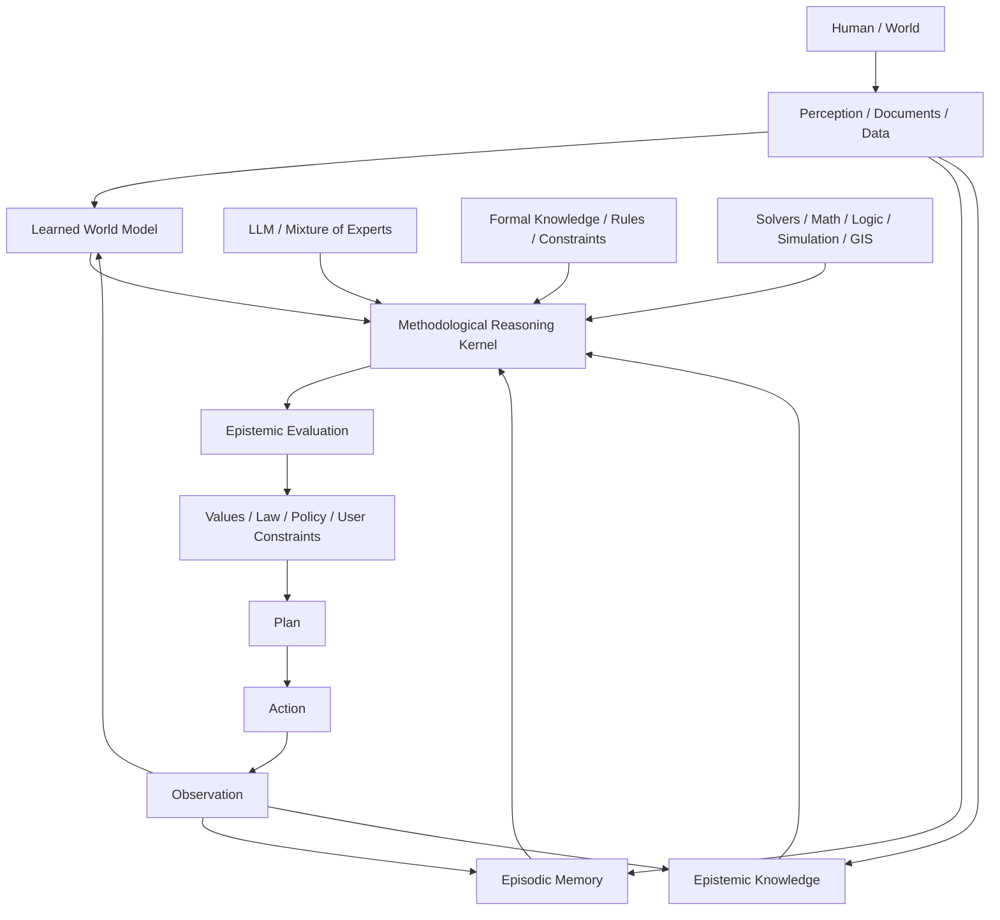

# Vision — towards an epistemically traceable cognitive architecture

> Version française : [epistemic-reasoning-vision.fr.md](epistemic-reasoning-vision.fr.md)

> Working document — August 2026  
> Status: **research vision**, not an implementation decision.

## 1. Starting point

Talunor already rests on a strong principle: **a reliable agent is not simply a smarter LLM; it is a system in which actions, memory, confidence and learning cross explicit, verifiable boundaries.**

The reflection developed here extends that idea.

Today's LLMs are remarkably capable at language, abstraction, synthesis, analogy and code. But they are probably not, on their own, the final architecture of a reliable general intelligence.

Our working position is that the future most likely belongs to **hybrid cognitive architectures** combining several specialised faculties:

- language models / Mixture of Experts;
- world models;
- formal knowledge and solvers;
- episodic and semantic memory;
- traceable epistemic memory;
- specialised tools;
- planning and action;
- an explicit methodological reasoning protocol.

The LLM remains a central piece, but it must no longer be confused with the whole system.

---

## 2. The central intuition: distinguish knowing, believing, inferring and not-knowing

A reliable intelligent system must be able to explicitly distinguish:

- what it **observes**;
- what it **knows**;
- what it **assumes**;
- what it **infers**;
- what is **contested**;
- what has been **refuted**;
- what it still **does not know**.

A piece of information should not be represented merely as a value:

```text
Earth.shape = oblate_spheroid
```

but as an **assertion accompanied by its genealogy**:

```text
Claim
 ├─ value
 ├─ evidence[]
 ├─ counterEvidence[]
 ├─ sources[]
 ├─ provenance
 ├─ timestamp
 ├─ confidence
 ├─ assumptions[]
 ├─ inference trace
 ├─ status
 └─ supersession / contradiction links
```

In other words:

```text
Knowledge = Claim
          + Evidence
          + Provenance
          + Confidence
          + Time
          + Contradictions
```

This property becomes critical in a world where the volume of synthetic, biased or deliberately manipulative content can grow much faster than the production of reliable knowledge.

The frequency of an assertion must never be confused with its soundness:

```text
frequency != evidence
```

---

## 3. Why a hybrid architecture

### 3.1 LLM / Mixture of Experts

Language models are particularly well suited to:

- language understanding;
- abstraction;
- synthesis;
- analogy;
- code generation;
- hypothesis formulation;
- natural interaction with humans.

They must remain a major component of the architecture.

### 3.2 World models

Yann LeCun's work around JEPA highlights an important limit of the purely autoregressive paradigm: predicting the next token is not equivalent to possessing an internal model of the world that can predict the consequences of actions.

A *world model* instead aims at:

```text
observe -> represent -> predict -> plan -> act -> compare -> learn
```

Our position is therefore not **LLM or world model**, but rather:

```text
LLM + world model
```

as complementary faculties.

### 3.3 Formal knowledge and solvers

Some knowledge should not depend on a statistical consensus of the Web.

For mathematics, logic, geometry or certain physical constraints, the system should be able to delegate to deterministic or formal engines:

- Lean / Coq / Isabelle;
- SMT solvers;
- CAS;
- PostGIS / GEOS;
- physics simulators;
- specialised rule engines.

The principle is simple:

> **Intelligence also consists in knowing when not to reason with the LLM.**

An LLM can propose a proof; a theorem prover decides whether it is valid.

An LLM can identify a geometric operation; PostGIS or GEOS computes the intersection.

---

## 4. A foundational knowledge base, but not a gigantic `world.pl`

The idea of a "PROLOG-style" knowledge base is relevant for certain categories of knowledge:

```prolog
human(socrates).
mortal(X) :- human(X).
```

It offers an essential property: the conclusion remains explicitly linked to the premises.

But reality is:

- continuous;
- probabilistic;
- incomplete;
- contradictory;
- temporal;
- contextual;
- full of exceptions.

It therefore seems preferable to imagine **several specialised systems** rather than a single logical base representing the entire world.

A possible hierarchy of knowledge would be:

### Level A — formal

- logic;
- mathematics.

### Level B — extremely consolidated scientific models

- thermodynamics;
- electromagnetism;
- relativity;
- atomic theory;
- evolution.

### Level C — empirical knowledge

- statistical relationships;
- evidence-based medicine;
- climate phenomena;
- probabilistic causalities.

### Level D — observations

- measurements;
- events;
- temporal data.

### Level E — interpretations

- possible explanations;
- projections;
- causalities still under discussion.

### Level F — values and normative constraints

- laws;
- policies;
- human preferences;
- ethical principles.

These categories must remain explicitly separated.

---

## 5. No embedded "official morality"

Formal knowledge can be proven.

A physical law can be confronted with experiment.

A universal moral rule does not have the same status.

One must therefore avoid turning normative choices into pseudo-scientific truths.

The system should explicitly distinguish:

```text
FACT
INTERPRETATION
VALUE
LAW
POLICY
```

Then be able to reason, for example:

```text
According to the principle of autonomy, A is preferable.
According to a utilitarian approach, B might be preferable.
The law imposes C.
Internal policy imposes D.
These constraints are partially incompatible.
```

The role of the architecture is not to impose a single philosophy, but to make **the normative premises visible**.

---

## 6. The central piece: an epistemic protocol

The reflection initially formulated as a "philosophical and ethical" dimension is better described as a **methodological discipline of reasoning**.

Descartes provides an excellent starting point.

### 6.1 The four Cartesian rules translated for an agent

| Rule | Architectural translation |
|---|---|
| Evidence | Do not promote an assertion to the status of fact without sufficient justification |
| Analysis | Decompose a complex question into verifiable sub-claims |
| Order / synthesis | Build the reasoning from the most established towards the most complex |
| Enumeration / review | Check for omissions, contradictions and alternative hypotheses |

Above these rules stands **methodical doubt**:

> suspend the status of truth as long as the reasons for accepting it remain insufficient.

This faculty of **suspending judgement** is probably as important as the faculty of answering.

A reliable system must be able to produce:

```text
I don't know yet.
I need evidence.
The available evidence remains insufficient.
```

without considering that a failure.

---

## 7. Descartes is not enough: an extended methodological protocol

The methodological core could combine several traditions:

### Descartes

- methodical doubt;
- decomposition;
- ordered construction;
- complete review.

### Hume

- caution about causality and induction;
- correlation / causation distinction.

### Bayes

- degrees of belief;
- updating according to observations.

### Popper

- falsifiability;
- active search for counter-examples.

### Peirce

- abduction;
- search for the best available explanation.

### Modern science

- measurement;
- reproducibility;
- independence of sources;
- critical confrontation;
- revision of knowledge.

The goal is not to embed a philosophy as dogma, but to provide an **auditable epistemic protocol**.

---

## 8. Separating the epistemic layer from the methodological kernel

Two responsibilities should probably remain distinct.

### Epistemic Layer

Answers:

> **What do we know about this information?**

It manages:

- source;
- provenance;
- confidence;
- freshness;
- contradictions;
- independence of evidence;
- knowledge status.

### Methodological Reasoning Kernel

Answers:

> **Do we have the intellectual right to draw this conclusion?**

It applies, for example:

```text
1. doubt
2. decompose
3. establish
4. infer
5. challenge
6. synthesize
7. review
```

---

## 9. Reference cognitive architecture



Another compact formulation would be:

```text
LLM
+ World Model
+ Formal Knowledge
+ Epistemic Memory
+ Methodological Reasoning
+ Tools
+ Planning / Action
```

---

## 10. The Proposer / Challenger / Arbiter pattern

An important conclusion should ideally not be produced by a single generative path.

A possible architecture:

```text
PROPOSER
   |
   | hypothesis / conclusion
   v
CHALLENGER
   |
   | counterarguments / missing evidence / falsification
   v
ARBITER
   |
   | compare evidence and constraints
   v
CONCLUSION
```

These are not necessarily three distinct LLMs. They are above all **three cognitive responsibilities**.

The Challenger must actively attempt to refute the conclusion produced by the Proposer.

This counters a natural defect of generative models: the tendency to pursue a coherent answer once a first hypothesis has been committed to.

---

## 11. Example: processing an extraordinary claim

Input:

```text
No one is allowed to fly over Antarctica because an ice wall hides the edge of the Earth.
```

### Step 1 — suspension of judgement

```text
Claim status: unverified
```

### Step 2 — decomposition

```text
C1: Antarctica surrounds the world's oceans.
C2: Antarctica constitutes a wall.
C3: Aircraft are prohibited from crossing it.
C4: The prohibition exists to conceal Earth's geometry.
```

### Step 3 — search for independent elements

```text
C1 -> geography / geodesy / expeditions
C2 -> topology / observation
C3 -> aviation rules / flight records
C4 -> evidence of intent required
```

### Step 4 — logical control

Even if `C3` were true, it would not demonstrate `C4`.

The system must be able to detect this kind of logical leap.

### Step 5 — synthesis

```text
Evidence(C1) strongly contradicts C1
Evidence(C2) strongly contradicts C2
Evidence(C3) contradicts C3
Evidence(C4) absent
```

### Step 6 — counter-test

The Challenger attempts to find an alternative explanation compatible with the observations.

### Step 7 — conclusion

The result must preserve:

- conclusion;
- evidence;
- counter-evidence;
- uncertainties;
- reasoning trace;
- sources.

---

## 12. Consequence for Talunor

Talunor can start very modestly.

It already possesses several building blocks compatible with this vision:

- multi-tier memory;
- provenance;
- confidence;
- consolidation;
- policy boundaries;
- tools;
- perception / recall / reasoning / action / learning loop.

The next possible conceptual evolution is to make memory not only a store of durable facts, but a store of **epistemically qualified claims**.

A conceptual structure could evolve towards:

```text
Claim
 ├─ Evidence[]
 ├─ CounterEvidence[]
 ├─ Sources[]
 ├─ Dependencies[]
 ├─ Assumptions[]
 ├─ Confidence
 ├─ Status
 └─ Supersession[]
```

with a record of inferences:

```text
Inference
 ├─ premises[]
 ├─ method
 ├─ conclusion
 ├─ verifier
 └─ trace
```

A possible state machine for claim status:

```text
Unexamined
 -> Hypothesis
 -> Supported
 -> StronglySupported
 -> Established

with possible branches:

Contested
Refuted
Superseded
```

No important transition should occur without traceable justification.

---

## 13. Proposed architectural principle

A synthetic formulation could become a guiding principle for Talunor:

> **Talunor must not only memorise what it believes it knows. It must be able to explain why it grants it that status, which evidence supports it, what could refute it and how that knowledge has evolved.**

Or, even shorter:

> **Never turn an assertion into knowledge without preserving its epistemic lineage.**

---

## 14. Why this goes beyond Talunor

This architecture also has direct relevance for future AI-assisted business systems, particularly document management or case management systems.

A piece of business data such as:

```text
idActeur = 1234
```

may originate from an inference:

```text
Assertion
 ├─ value: Acteur #1234
 ├─ source: incoming document #98765
 ├─ method: entity resolution
 ├─ confidence: 0.91
 ├─ evidence[]
 ├─ model / agent
 ├─ timestamp
 ├─ human validation
 └─ status
```

The business system can use `idActeur=1234`, but it should not lose the genealogy that produced that value.

The same principle applies to any automated or assisted decision:

```text
SOURCE
  -> OBSERVATION
  -> ASSERTION
  -> EVIDENCE
  -> INFERENCE
  -> KNOWLEDGE
  -> DECISION
  -> ACTION
```

Every important transition should remain inspectable.

---

## 15. Strategic risk: epistemic contamination of the Web

The massive growth of synthetic content creates a new risk:

```text
AI1 -> Web -> AI2 -> Web -> AI3
```

with, inside it:

```text
humans
+ marketing
+ propaganda
+ bots
+ states
+ activist networks
+ synthetic content farms
```

In this environment:

```text
N sources != N independent sources
```

A million apparently independent documents can share a single causal origin.

This makes provenance, independence of evidence and the preservation of reliable corpora particularly important.

Future knowledge will therefore probably have to be evaluated not only on its content but also on:

- origin;
- authenticity;
- independence;
- temporality;
- chain of transformations;
- corroboration;
- possibility of external verification.

---

## 16. Open questions for the next iterations

This document must not be considered a roadmap. It opens research questions.

### Data model

- What is the minimal representation of a `Claim`?
- How to distinguish `Fact`, `Observation`, `Hypothesis`, `Inference`?
- How to represent contradictions?
- How to represent temporal supersession?

### Confidence

- Is confidence a probability?
- Should it be multidimensional?
- How to avoid false numerical precision?
- How to account for the independence of sources?

### Reasoning

- Which steps must be explicitly coded?
- Which steps can remain entrusted to the LLM?
- When should a Challenger be triggered?
- What level of criticality imposes a complete review?

### Formalisation

- Is a mini rule engine needed?
- Datalog / Prolog / CEL / Rego / SMT?
- How to call specialised solvers?
- How to trace formal proofs?

### World models

- Where would a world model bring real value to Talunor?
- Can one start with causal models or specialised simulators before any general neural model?

### Provenance

- What granularity should be preserved?
- How to sign or authenticate sources?
- How to detect that several sources actually come from a single origin?

### Performance

- Must every reasoning go through the complete protocol? Probably not.
- How to distinguish an ordinary conversation from a high-stakes decision?

---

## 17. Proposed direction of work

For a first Talunor experiment, do not attempt to build the complete cognitive architecture.

Start with a narrow vertical:

```text
Claim
+ Evidence
+ Source
+ Confidence
+ Contradiction
+ Supersession
```

Then experiment with one operation:

```text
assess(claim)
```

which would produce something like:

```text
status
confidence
supporting evidence
counter evidence
missing evidence
assumptions
falsification criteria
```

And only then, test a protocol:

```text
doubt
-> decompose
-> retrieve
-> establish
-> infer
-> challenge
-> review
-> answer
```

This progression makes it possible to test the real value of the concept before introducing excessive architectural complexity.

---

## Conclusion

Our working hypothesis is that future reliable AIs will probably be neither pure LLMs, nor pure world models, nor classical symbolic systems.

They will most likely be **hybrid cognitive architectures** in which:

- the LLM masters language and abstraction;
- the world model predicts and represents the dynamics of the real;
- solvers guarantee certain formal conclusions;
- tools provide deterministic access to the world;
- memory preserves experiences;
- the epistemic layer preserves the genealogy of knowledge;
- the methodological kernel imposes doubt, decomposition, verification and contradiction;
- values, laws and policies remain explicitly separated from facts.

The central question is then no longer only:

> **What does the model know?**

but:

> **Why does the system consider this proposition true, with what level of confidence, on which evidence, and what could change its mind?**

This question could constitute one of the most interesting research axes for Talunor's evolution.
